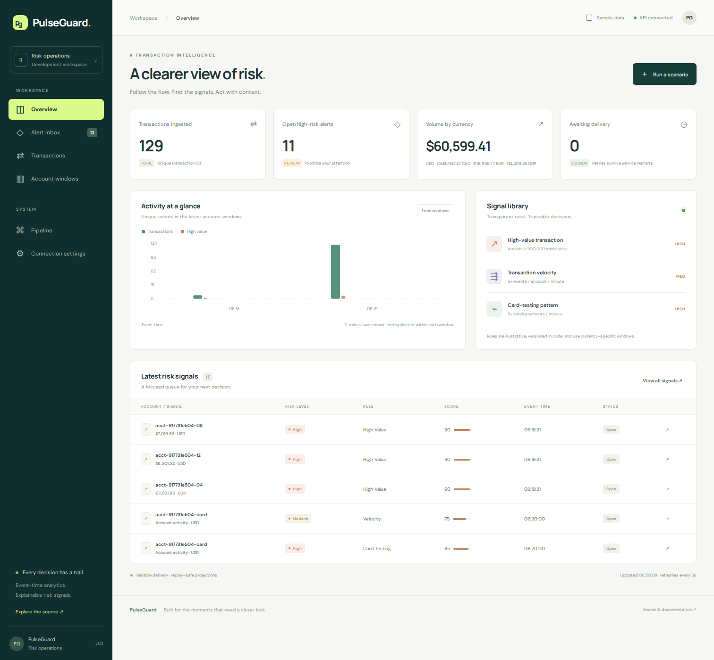
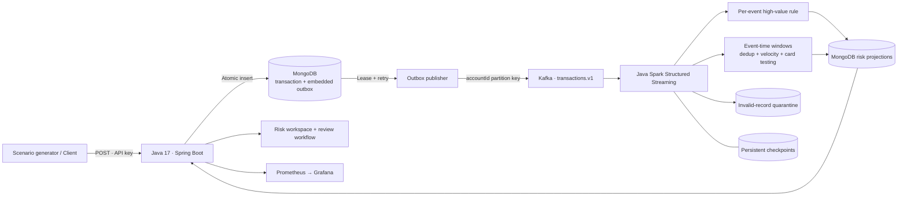

<div align="center">

# PulseGuard

**Real-time transaction risk analytics. Built to explain every signal and survive replay.**

[](https://github.com/wxw2002a/pulseguard/actions/workflows/ci.yml)
[](https://github.com/wxw2002a/pulseguard/actions/workflows/kubernetes.yml)


[Architecture](docs/architecture.md) · [Integration](docs/integration.md) · [Runbook](docs/runbook.md) · [API contract](contracts/openapi.yaml) · [Verification](docs/verification.md)

</div>

PulseGuard is an **e-commerce payment event monitoring and investigation system**. It accepts transaction events, delivers them reliably through Kafka, computes explainable risk signals with **Java Spark Structured Streaming**, and exposes a review workflow backed by MongoDB. The repository includes synthetic event generation, a live investigation dashboard, deployment manifests and automated recovery checks.

## Problems it addresses

- **Retried callbacks inflate payment counts:** immutable transaction IDs and conflict detection prevent a repeated callback from creating a second ledger entry; exact in-window deduplication also handles a republished Kafka event.
- **A broker outage loses accepted work:** the transaction and outbox are committed together before HTTP acceptance. Publication can recover from an expired lease or a failed broker connection.
- **Suspicious activity has no investigation trail:** concentrated small payments, high transaction frequency and large payments produce explainable signals. Operators can inspect the matching original transactions and record a reasoned decision with a preserved review history.

The system monitors events after they are received; it does not authorize, block, refund or move money. A payment service integrates by posting its normalized events to the ingestion API with a stable transaction ID. The included generator drives that same interface using synthetic data.



*Captured from the [successful Compose run](https://github.com/wxw2002a/pulseguard/actions/runs/34742387094): 129 synthetic transaction events were submitted through the real API, Kafka, Spark and MongoDB stack. The dashboard is in live mode; Sample data is off. [Reports and scope](docs/verification.md) are retained in the repository.*

## Engineering capabilities

| Engineering problem | Implemented solution | Where to look |
|---|---|---|
| API succeeds but the broker is unavailable | MongoDB single-document embedded outbox, atomic leases, bounded retries, acknowledgement ownership checks | [Outbox](services/api/src/main/java/io/pulseguard/api/outbox) |
| A client retries after a timeout | Immutable transaction ID; identical payload accepted, conflicting payload returns HTTP 409 | [Transaction service](services/api/src/main/java/io/pulseguard/api/transaction/TransactionService.java) |
| Kafka replays events after failure | Stable alert IDs, exact deduplication within event-time windows, full snapshot upserts | [Streaming engine](services/streaming/src/main/java/io/pulseguard/streaming) |
| Events arrive out of order | One-minute tumbling windows with a two-minute watermark and persistent query checkpoints | [Transforms](services/streaming/src/main/java/io/pulseguard/streaming/StreamTransforms.java) |
| Bad records poison a stream | Strict schema parsing and deterministic quarantine keyed by topic/partition/offset | [Parser](services/streaming/src/main/java/io/pulseguard/streaming/TransactionParser.java) |
| Replay overwrites an analyst's decision | Alert creation uses `$setOnInsert`; review status and decision history survive reprocessing | [Mongo sinks](services/streaming/src/main/java/io/pulseguard/streaming/MongoSinks.java) |
| An alert cannot be investigated | Match original transaction evidence by event ID or indexed account/currency/time window; atomically append reasoned reviews | [Investigation service](services/api/src/main/java/io/pulseguard/api/investigation/InvestigationService.java) |
| A diagram works but the system does not | CI starts actual Kafka, MongoDB, Java and Spark; checks duplicate delivery and restart recovery | [End-to-end checks](scripts/e2e.py) |

## Architecture



The delivery contract is **at least once with replay-safe MongoDB projections**, under an immutable-event contract and a single active writer per checkpoint. MongoDB and Kafka do not participate in a global transaction. Independent Spark queries and MongoDB collections are eventually consistent. The [architecture notes](docs/architecture.md) explain the boundaries.

## Run locally

Prerequisites: Docker Engine/Desktop with Compose v2 and Python 3.10+. Allocate approximately 4 CPU and 6–8 GB RAM for the full development stack. Java/Maven on the host are optional because images build the applications.

```bash
git clone https://github.com/wxw2002a/pulseguard.git
cd pulseguard
docker compose up -d --build
python scripts/e2e.py --timeout 300
python scripts/load_generator.py --count 120 --rate 10 --save-events artifacts/events.jsonl
```

Open **[localhost:8080](http://localhost:8080)**. In **Connection settings**, enter `local-dev-key` (the local development default); use **Run a scenario** to send mixed traffic, a velocity burst, a high-value payment or a card-testing pattern. Select an alert to inspect its original transaction evidence, enter an operator label and decision note, and save the review. Previous decisions remain visible in its history.

| Endpoint | Purpose |
|---|---|
| `http://localhost:8080` | Risk workspace, real API by default |
| `http://localhost:8080/?demo=1` | Explicit synthetic preview, no backend writes |
| `http://localhost:8080/actuator/health/readiness` | API + MongoDB + Kafka readiness |
| `http://localhost:8080/actuator/prometheus` | HTTP/JVM and outbox metrics |
| `http://localhost:4040` | Spark UI |

Optional monitoring:

```bash
docker compose --profile monitoring up -d
```

Grafana: [localhost:3000](http://localhost:3000), local credentials `admin` / `local-grafana-only`; Prometheus: [localhost:9090](http://localhost:9090). All published Compose ports bind to loopback. These are development credentials, and the stack is not a public production deployment.

Windows commands work in PowerShell; use `python` and Docker as above. For host builds use `.\mvnw.cmd` instead of `./mvnw`. If Docker Desktop fails **before containers start**, see the [environment troubleshooting](docs/runbook.md#docker-desktop-fails-before-containers-start).

## API contract

```json
{
  "schemaVersion": 1,
  "transactionId": "txn_example_001",
  "accountId": "account_042",
  "merchantId": "merchant_007",
  "amountMinor": 750000,
  "currency": "USD",
  "country": "US",
  "channel": "WEB",
  "eventTime": "2026-09-13T06:00:00.123456Z"
}
```

Send a **current UTC eventTime** for a live demonstration; old event times may be outside the window watermark. Money is an integer in minor units: `750000 USD` means `$7,500.00`. No cross-currency total is presented.

| Method | Route | Behavior |
|---|---|---|
| POST | `/api/v1/transactions` | API key; `202 {transactionId,status,duplicate}`; conflicting retry `409` |
| GET | `/api/v1/transactions?limit=100` | Recent accepted events and delivery status |
| GET | `/api/v1/alerts?limit=100&severity=HIGH` | Risk signals, reasons and review status |
| GET | `/api/v1/alerts/{id}` | Detail, latest 50 review entries and total review count |
| GET | `/api/v1/alerts/{id}/evidence?limit=200` | Original transaction or matching account/currency/window transactions |
| PATCH | `/api/v1/alerts/{id}/review` | API key; body `{"status":"INVESTIGATING","analyst":"risk-team","note":"Checking related merchant activity"}` |
| GET | `/api/v1/windows?limit=100` | Account/currency window snapshots |
| GET | `/api/v1/overview` | Counts, unresolved high risk, currency-separated volumes, outbox backlog |

List endpoints return `{"items":[...]}`. Percent-encode alert IDs when placing them in paths. Reviews atomically append to a bounded 500-entry history; a full history returns 409 instead of silently dropping older decisions. The operator label is self-reported, not an authenticated identity. See [the JSON Schema](contracts/transaction.v1.schema.json) and [the OpenAPI contract](contracts/openapi.yaml).

## Risk rules

| Rule | Trigger | Scope |
|---|---|---|
| `HIGH_VALUE` | Amount ≥ 500,000 minor units | Individual transaction |
| `VELOCITY` | ≥ 5 distinct transactions per minute | Account + currency + event-time window |
| `CARD_TESTING` | ≥ 5 transactions of ≤ 1,000 minor units per minute | Account + currency + event-time window |

These are transparent demonstration rules. They are not trained fraud models, real payment controls, or empirically validated loss-prevention policies.

## Verify the behavior

**Verified:** [57 Java tests with zero skips and a complete Compose recovery run](https://github.com/wxw2002a/pulseguard/actions/runs/34742387094), plus [actual deployment and pipeline checks on Kubernetes](https://github.com/wxw2002a/pulseguard/actions/runs/34742236882). The recovery test stops Kafka, accepts a transaction while the broker is unavailable, and confirms delivery and risk analysis after Kafka returns. Original transaction evidence and review-history preservation are also checked.

```bash
./mvnw -B -ntp verify                         # Java compilation, unit/MVC tests and JARs
./mvnw -B -ntp -Pintegration,spark-tests verify # Linux: real Spark + Testcontainers
python scripts/validate_configs.py           # Compose, Kustomize, config checks
python scripts/e2e.py --with-recovery         # Running Compose: duplicate + restart checks
python scripts/load_generator.py --count 1000 --rate 0 --workers 16
```

The generator writes measured HTTP acceptance latency/throughput into `artifacts/`; it does **not** measure end-to-end Spark latency. Do not turn those numbers into pipeline throughput claims. [Verification evidence and limitations](docs/verification.md) describe exactly what has run.

Optional browser checks: `npm ci --prefix tests/dashboard`, then from `tests/dashboard` run `npx playwright install chromium` and `npm test`. The browser test checks preview labeling, filtering, review, request authentication, unique scenario IDs, HTML escaping, mobile layout and offline behavior.

## Kubernetes

[Deployment guide](infra/k8s/README.md) covers Kustomize, persistent Kafka/MongoDB storage, application health probes, API HPA/PDB and Spark checkpoint storage.

The default development configuration runs Spark in **one Kubernetes pod with `local[2]`**. A separate [native cluster-mode submission script](scripts/spark-submit-k8s.sh) creates driver/executor pods and requires shared checkpoint storage. Native distributed mode must be validated on a suitable cluster; it is not covered by Compose CI.

## Repository map

```text
services/api/          Spring Boot ingestion, outbox, investigation API, dashboard
services/streaming/    Java Spark jobs, rules, parser, executor-side Mongo sinks
contracts/            Versioned JSON Schema and OpenAPI contract
infra/k8s/            Kustomize manifests, storage and native Spark notes
infra/monitoring/     Prometheus and provisioned Grafana dashboard
scripts/              Scenario/load generator, e2e and recovery checks
tests/dashboard/      Browser-level behavioral tests
docs/                 Architecture decisions, operations and verification evidence
.github/workflows/    Repeatable build, tests and pipeline evidence
```

## Deliberate boundaries

- Exact deduplication retains the set of transaction IDs in each open account window. The watermark bounds time, not the maximum events per hot account; validate memory at your intended rate.
- Read APIs and dashboard access are unauthenticated in the local development configuration. Mutation endpoints require an API key. Add user identity, authorization and private ingress before using sensitive data.
- Local Kafka and MongoDB are single-node. Availability, Kafka TLS/SASL, MongoDB authentication/replication and backups require a production deployment design.
- Overview totals scan current data and are appropriate for a demonstration; larger installations need precomputed aggregates and measured query budgets.
- Rules, state schema and checkpoints are versioned operational concerns. Rebuilding into populated projections needs a migration plan.

MIT licensed. The code and documentation are designed to be read, run, challenged and extended.
