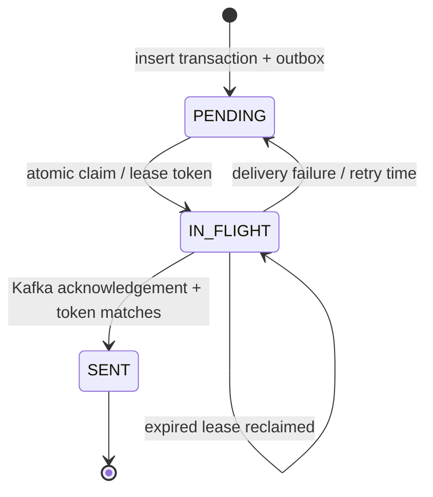

# Architecture and guarantees

## 1. Acceptance is a durable database operation

The API validates version, identity fields, integer money, enums and event time. MongoDB's `_id` is the caller's transaction ID. One insert creates both the immutable payload and embedded outbox state. No broker call is required to establish the accepted record.

A duplicate-key race is resolved by reading the existing payload: an equal payload returns a duplicate acceptance, while a different payload returns 409. `eventTime` is stored as a canonical ISO string through a field-specific converter, because BSON dates truncate nanoseconds and would otherwise break equality on retry. Operational timestamps remain BSON dates for indexed queries.

**ADR 001 — embedded outbox:** a separate outbox collection would require a MongoDB transaction/replica set to achieve the same atomic acceptance property. The embedded document is a deliberate fit for this model. The worker's atomic `findAndModify` claims eligible records with a lease and a unique owner token. A stale worker cannot mark a newer lease as complete.

The diagram shows logical states; the code's exact field/state names are authoritative. If the process dies after Kafka acknowledges but before MongoDB records success, the next worker republishes the event. This is expected at-least-once behavior. Kafka producer idempotence protects producer retries within its session; it cannot remove all application-level republishes across process restarts.

## 2. Kafka defines the replayable transport

`transactions.v1` has six partitions in the development setup, keyed by account ID. The account key establishes a useful per-partition log order, while event-time processing handles arrival disorder. The API is the supported writer: it enforces that a transaction ID always denotes the same payload.

Direct Kafka producers must obey this contract. In particular, the exact window set uses `(transactionId, amountMinor)` within `(accountId, currency, window)`. If an external writer changes the amount, currency or event time for an existing ID, it has violated the contract; this implementation does not maintain an unbounded global identity ledger in Spark. The e2e duplicate injector sends the same original event.

## 3. Two independent Spark queries

The job decodes records with a strict parser and retains Kafka coordinates. It then starts:

- **Event decisions and quarantine:** stateless `foreachBatch` processing writes high-value alerts and invalid-record quarantine documents. Invalid keys are `topic:partition:offset`; payload excerpts are bounded. This query examines old valid events even if the window query can no longer include them.
- **Account windows:** event-time `window(eventTime, '1 minute')`, account ID and currency group the valid stream; a two-minute watermark permits bounded disorder. An exact `collect_set` of immutable event identities and amounts derives unique counts, sums and rule inputs. Update mode emits full current snapshots.

**ADR 002 — one stateful operator:** combining a separate streaming deduplication stage with an updating aggregation can introduce unsupported stateful plans and additional recovery boundaries. A single window aggregate makes exact deduplication explicit. It stores more state than an approximate sketch; a hot account can still accumulate a large set inside one minute. The watermark bounds event time, not input cardinality. This tradeoff is intentional and should be measured before increasing throughput.

Spark may retain multiple windows while awaiting a watermark. A watermark is derived from observed event times, not wall-clock time; a quiet stream need not evict state immediately. The parser rejects events more than 30 seconds ahead of their Kafka record timestamp to limit accidental future-time poisoning. This tolerance stays below the two-minute watermark delay. Kafka timestamps from untrusted direct producers are not an independent security boundary.

Each query has its own checkpoint subdirectory. A task or batch write failure is propagated; after configured Spark retries are exhausted, the process fails. Container restart resumes with the same checkpoint. The local deployment keeps checkpoints on a named Docker volume; the Kubernetes development deployment uses a PVC.

## 4. Replay-safe MongoDB projections

| Projection | Stable identity | Write behavior |
|---|---|---|
| High-value alert | Rule + transaction ID | `$setOnInsert` |
| Window-level alert | Rule + account + currency + window start | `$setOnInsert` |
| Window metrics | Account + currency + window start | Replace absolute snapshot / upsert |
| Quarantine record | Kafka topic + partition + offset | `$setOnInsert` |

Sink writes execute per Spark partition using short-lived MongoDB clients and bounded unordered bulk batches. No full micro-batch is collected into the driver. The MongoDB driver requests majority write concern; single-node development topology still cannot tolerate node loss.

**ADR 003 — alerts are detection evidence:** window alerts preserve the first threshold-crossing snapshot. Later window metrics can increase while the original alert evidence remains unchanged. `$setOnInsert` also preserves `status` and `reviewedAt` assigned by a human. An alert and its window are not committed atomically across collections; transient partial visibility is possible, and replay completes missing writes.

**ADR 004 — replace snapshots rather than increment:** `$inc` would add the same money again on retry. Replacing a deterministic key with its current full aggregate is idempotent for an ordinary checkpoint replay. A manual checkpoint deletion or an overlapping second writer can replay older snapshots into newer data. Rebuild into new projections, validate, then switch readers; never run simultaneous copies sharing a checkpoint.

## 5. API and observability boundaries

GET routes expose a bounded recent list and a dashboard overview; PATCH records review status. Mutation endpoints use an API key. The key is held in browser session storage, not embedded into source, and UI strings derived from API records are escaped. Read APIs are intentionally public within the local demonstration.

Readiness checks MongoDB and Kafka; liveness avoids depending on them to prevent restart storms during dependency outages. A broker outage can therefore make the API unready in Kubernetes even though the underlying acceptance/outbox mechanism can persist events. This is a conservative routing choice; change readiness policy if offline acceptance is part of your SLO. Metrics include accepted/duplicate/conflicting requests, outbox publication and retries, HTTP latency and JVM health. Spark logs query progress, watermark and state metrics; the Spark UI provides execution details. The provided Grafana dashboard primarily covers the API, not a fully instrumented distributed Spark fleet.

## 6. Scale and deployment

API instances share MongoDB and compete safely for outbox leases. HPA applies only to the API. Kafka partitions and Spark task/executor configuration define compute parallelism. Development Kafka, MongoDB and Spark are each single-instance: this is an executable development architecture, not demonstrated high availability.

Native Spark Kubernetes cluster mode is supplied separately and requires shared checkpoint storage mounted consistently on driver and executors. The local Compose and single-pod Kubernetes modes do not prove multi-node recovery. Likewise, no load-test number is evidence of fraud accuracy.

## References

- [Spark 3.5.8 Structured Streaming guide](https://spark.apache.org/docs/3.5.8/structured-streaming-programming-guide.html): state, watermarks, output modes, `foreachBatch` and recovery.
- [Spark 3.5.8 Kafka integration](https://spark.apache.org/docs/3.5.8/structured-streaming-kafka-integration.html): source options and Kafka delivery behavior.
- [Spark on Kubernetes](https://spark.apache.org/docs/3.5.8/running-on-kubernetes.html): native driver/executor deployment.
- [Spring Boot 3.5 system requirements](https://docs.spring.io/spring-boot/3.5/system-requirements.html): Java 17 compatibility.
- [MongoDB atomicity](https://www.mongodb.com/docs/manual/core/write-operations-atomicity/): single-document write semantics.
